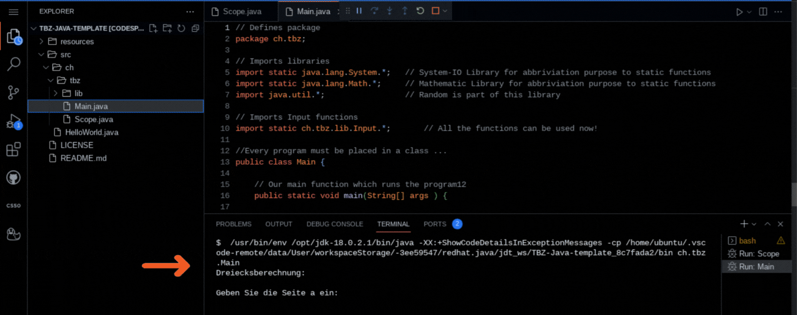

# 🖐️ Test your repo with codespace

* Click on "<> Code" then click on "+" to create codespace
* Navigate to the src/Main.java file
* Click on the "run" button

👍 You should get a pop up window indicating that the java program is being compiled, then your program will execute in the TERMINAL tab as shown below:

---

Credits: simplified version of the cs50 codespace repo
