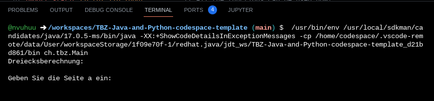

# Student repository

This is your student repository.

* Navigating to the src/Main.java file
* Click on the "run" button

You should get a pop up window indicating that the java program is being compiled, then your program will execute in the TERMINAL tab as shown below:

